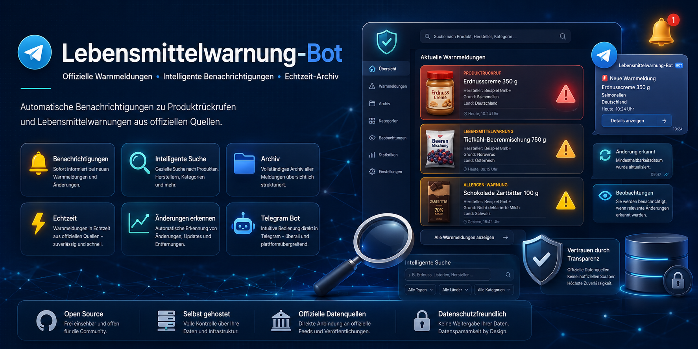

  

# Lebensmittelwarnung-Bot – Telegram Bot 🥫

Ein inoffizieller, intelligenter Telegram-Bot, der alle Meldungen von **lebensmittelwarnung.de** in Echtzeit verarbeitet. Er bietet automatische Benachrichtigungen, eine umfassende Archivierung im Forum-Stil und proaktive Änderungserkennung für deine Sicherheit.

🔗 **Offizielle Projekt-Webseite:** [telegramtrainer.github.io/Lebensmittelwarnung/](https://telegramtrainer.github.io/Lebensmittelwarnung/)

✈️ **Direkt zum Bot:** [@LebensmittelwarnungBot](https://telegram.me/lebensmittelwarnungbot)

---

## 🎯 Das Problem & Der Mehrwert

Die offizielle Informationssuche kann im Alltag umständlich sein. Unser Bot macht aus trockenen Feeds ein interaktives System, das dich genau dann alarmiert, wenn es für dich wichtig wird.

### Hauptfeatures:

* **📡 Offizielle Datenquelle:** Direkter Abruf der fünf offiziellen Typ-Feeds (Lebensmittel, Kosmetik, Bedarfsgegenstände, Baby-/Kinderprodukte, Tätowiermittel) – kein Scraping, hohe Zuverlässigkeit.
* **🔔 Intelligente Beobachtungen (`/watch`):** Abonniere spezifische Begriffe (z. B. *Erdnuss*) oder Kategorien. Die Suche ist umlaut-tolerant und bietet feinjustierbare Bereiche (Hersteller, Grund, Typ, Land).
* **🔄 Änderungserkennung:** Wird eine Meldung aktualisiert (z. B. Mindesthaltbarkeitsdatum), erkennt der Bot dies automatisch, editiert den Gruppenpost und informiert bei Bedarf via DM.
* **⛔️ Offline-Erkennung:** Verschwindet ein Produkt aus allen Feeds, markiert der Bot dies transparent als „Nicht mehr gelistet“.
* **🗂 Strukturierte Archivierung:** Alle Meldungen werden automatisch in einer Forum-Gruppe (Themen/Topics) nach Produkttyp sortiert und sauber formatiert abgelegt.

---

## 📱 Die Vorteile via Telegram

Im Vergleich zu einer statischen Webseite bietet die Integration in Telegram entscheidende Vorteile:

* **Push-Benachrichtigungen:** Erhalte Treffer direkt per DM, inklusive Rückruf-Funktion und direktem Link zum detaillierten Gruppenpost.
* **Keine App-Installation:** Läuft nativ in Telegram – plattformübergreifend auf iOS, Android, PC und Web.
* **Intuitiv & Schnell:** Steuerung über einfache Befehle, interaktive Inline-Buttons und übersichtliche Status-Übersichten.

---

## 🛠️ Technische Details (Übersicht)

Das System ist auf hohe Performance und Zuverlässigkeit ausgelegt:

* **Architektur:** Event-gesteuertes Pushing, Deduplizierung über kanonische IDs und ein robustes System.
* **Transparenz:** Datenschutz und umfangreiche Admin-Werkzeuge für maximale Kontrolle.

---

## ⚖️ Rechtlicher Hinweis

Dieses Projekt ist ein **inoffizielles Angebot** und keine amtliche Quelle. Es steht in keiner Verbindung mit dem BVL oder der Plattform *lebensmittelwarnung.de*. Maßgeblich und rechtsverbindlich sind ausschließlich die offiziellen Veröffentlichungen der zuständigen Behörden.

---
